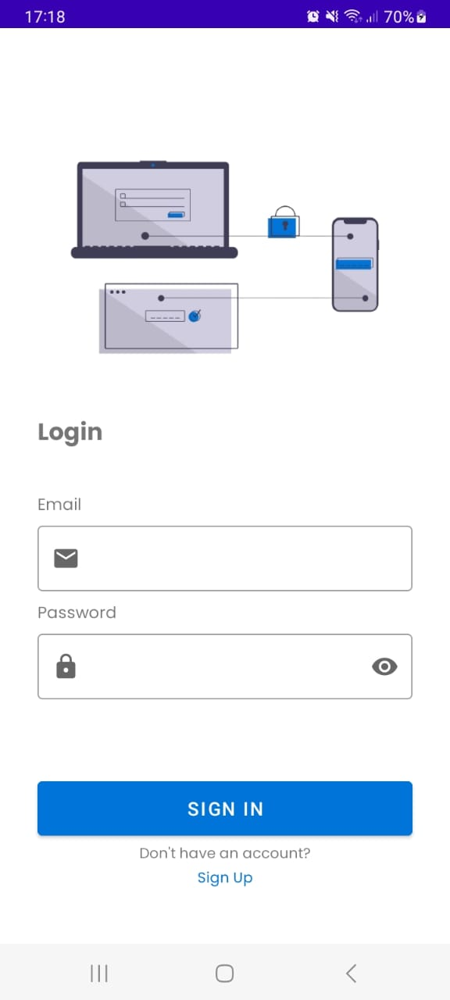
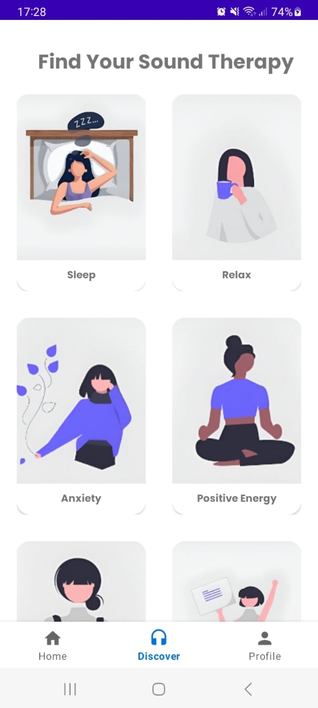
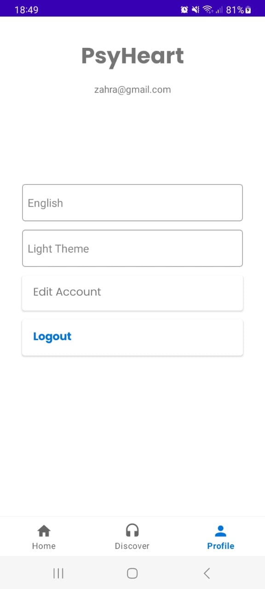
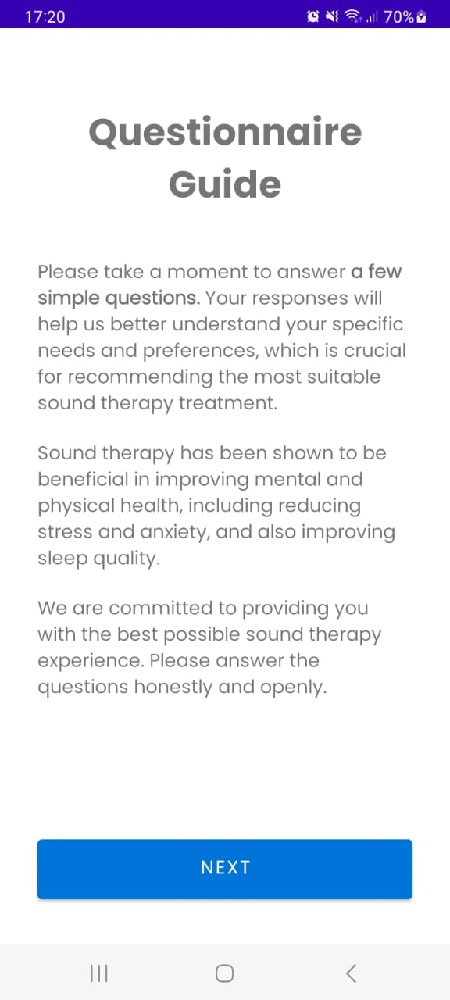
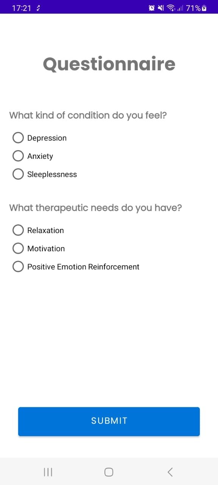

# Psy Heart

## Overview

Psy Heart is an Android application developed as part of the Bangkit Academy Capstone Project. The app provides music therapy tailored to the user's current emotional condition. By analyzing the user's inputs, Psy Heart suggests music tracks that are likely to improve their mental well-being.

## Features

- **Mood Analysis**: Input your current mood and get personalized music recommendations.
- **Music Library**: A curated library of therapeutic music tracks.
- **User-Friendly Interface**: Simple and intuitive design for easy navigation.

## Screenshots

### Authentication
<div style="display: flex; justify-content: center;">
    
    
</div>

### Menus
<div style="display: flex; justify-content: center;">
    
    
    
</div>

### Questionnaire
<div style="display: flex; justify-content: center;">ed
    
    
</div>


## Installation

To run this project locally, follow these steps:

1. **Clone the repository**:
    ```sh
    git clone https://github.com/PsyHeart-Capstone-Project/Mobile-Development.git
    ```

2. **Open the project in Android Studio**:
    - Open Android Studio.
    - Select `Open an existing project`.
    - Navigate to the cloned repository folder and select it.

3. **Build the project**:
    - Let Android Studio download and install any required dependencies.
    - Build the project using the Build menu or the toolbar button.

4. **Run the app**:
    - Connect an Android device or use an emulator.
    - Run the app from Android Studio.

## Usage

1. **Launch the app**.
2. **Input your mood** using the provided interface.
3. **Get music recommendations** tailored to your current condition.
4. **Play and enjoy** the recommended tracks directly within the app.

## Contributors

- **Naufalia Azzahra - A012D4KX4325** - [naufaliaa25](https://github.com/naufaliaa25)
- **Novita Sari Samosir - A325D4KX4015** - [535210091](https://github.com/535210091)
